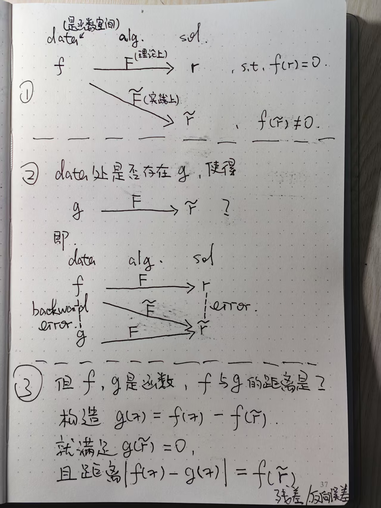

# 4-1-求根问题 (The rootfinding problem)

这是一份数值计算学习笔记，参考了 Tobin A. Driscoll and Richard J. Braun 的教材 [*Fundamentals of Numerical Computation* (2023)](https://tobydriscoll.net/fnc-julia/home.html).

> 这份笔记主要是翻译了原文内容，并删改或重新表述部分内容，希望能进一步减少初学者的学习障碍.

**#1 求根问题**

我们先聚焦于单变量单函数的 **rootfinding problem**.

> **Definition:** **Rootfinding problem**. Given a continuous scalar function $f$ of a scalar variable, find a real number $r$, called a **root**, such that $f(r)=0$.

求根问题 $f(x)=0$ 也可以看作解方程，如果我们想解 $g(x)=h(x)$，只要令 $f=g-h$，然后去找 $f$ 的根即可.

与前面章节的线性问题不同，这里常见的情况是：即使在精确算术下，根也无法用有限次运算直接写出来. 因此我们通常 **构造一个近似序列，让这个序列收敛到根**，并在某一项看起来 "足够好" 时停止.

在 Python 生态中，`scipy.optimize` 提供了通用的求根例程，例如 `scipy.optimize.root` (可用于向量变量) 以及标量专用的 `scipy.optimize.root_scalar`.

> **Demo:** **Finding roots of a Bessel function**. In the theory of vibrations of a circular drum, the displacement of the drumhead can be expressed in terms of pure harmonic modes,
> $$
> J_m(\omega_{k,m} r)\cos(m\theta)\cos(c\omega_{k,m}t),
> $$
> where $(r,\theta)$ are polar coordinates, $0\le r\le 1$, $t$ is time, $m$ is a positive integer, $c$ is a material parameter, and $J_m$ is a *Bessel function of the first kind*. The quantity $\omega_{k,m}$ is a resonant frequency and is a positive root of the equation
> $$
> J_m(\omega_{k,m}) = 0,
> $$
> which states that the drumhead is clamped around the rim.
>
> ```Python
> import numpy as np
> import matplotlib.pyplot as plt
> from scipy.special import jv
> from scipy.optimize import root
>
> def J3(x):
>     return jv(3, x)
>
> # Plot to get initial guesses.
> x = np.linspace(0.0, 20.0, 2000)
> plt.plot(x, J3(x))
> plt.axhline(0.0, color="k", lw=1)
> plt.title("Bessel function J_3(x)")
> plt.xlabel("x")
> plt.ylabel("J_3(x)")
> plt.grid(True)
> plt.show()
>
> roots = []
> for guess in [6.0, 10.0, 13.0, 16.0, 19.0]:
>     sol = root(lambda z: np.array([J3(z[0])]), x0=np.array([guess]), tol=1e-14)
>     roots.append(sol.x[0])
>
> for r in roots:
>     print(r, J3(r))
> ```
>
> After plotting, we can use the rough locations of the zeros as initial guesses, then refine them with a solver.

**#2 条件数：根对函数扰动的敏感性**

在求根问题里，**"数据"** 是一个连续函数 $f$，**"结果"** 是它的一个根. 我们关心的是：当 $f$ 发生扰动时，根会如何变化？这里我们会计算 **绝对条件数**，而不是相对条件数.

把函数当作数据去扰动，可能一开始看起来有点抽象. 但至少有两点是合理的：

- 第一，$f$ 的取值会用浮点数表示，必然有舍入误差.
- 第二，在许多应用中，$f$ 本身可能不是一个显式公式，而是某个数值过程的输出，也会引入误差.

虽然函数的扰动方式有很多种，但只考虑 "常数扰动" 就足够抓住关键现象. 假设 $f$ 在某个根 $r$ 附近至少有一阶连续导数. 把 $f$ 扰动为

$$
\tilde f(x)=f(x)+\epsilon,
$$

则对应的根 (若仍存在) 也会被扰动，从 $r$ 变为 $\tilde r=r+\delta$，以满足 $\tilde f(\tilde r)=0$. 我们定义绝对条件数 $\kappa_r$ 为 $\left|\frac{\delta}{\epsilon}\right|$ 在 $\epsilon\to 0$ 时的极限.

由 Taylor 展开，

$$
0=\tilde f(\tilde r)=f(r+\delta)+\epsilon \approx f(r)+f'(r)\delta+\epsilon.
$$

由于 $f(r)=0$，就能把 $\delta$ 与 $\epsilon$ 联系起来，从而得到条件数.

> **Theorem:** **Condition number of rootfinding**.
> If $f$ is differentiable at a root $r$, then the absolute condition number of $r$ with respect to constant changes in $f$ is
> $$
> \kappa_r = \bigl| f'(r) \bigr|^{-1}.
> $$
> We say $\kappa_r = \infty$ if $f'(r)=0$.

等价地，上式就是 $f^{-1}$ 在 0 处导数的绝对值.

> **Note?** 这个等价关系可以从 "反函数看扰动" 的角度理解得更直接. 由于 $\tilde f(x)=f(x)+\epsilon$，其根 $\tilde r$ 满足
> $$
> 0=\tilde f(\tilde r)=f(\tilde r)+\epsilon
> \quad\Longleftrightarrow\quad
> f(\tilde r)=-\epsilon.
> $$
> 若在 $r$ 附近 $f$ 存在局部反函数 (例如 $f'(r)\neq 0$，由反函数定理可知)，则
> $$
> r=f^{-1}(0),\qquad \tilde r=f^{-1}(-\epsilon),
> $$
> 从而
> $$
> \delta=\tilde r-r=f^{-1}(-\epsilon)-f^{-1}(0)\approx (f^{-1})'(0)\cdot(-\epsilon).
> $$
> 因此 $\left|\frac{\delta}{\epsilon}\right|\approx |(f^{-1})'(0)|$. 再由 $(f^{-1})'(0)=1/f'(r)$，就得到 $\kappa_r=|f'(r)|^{-1}$. 几何上，$|f'(r)|$ 越小，曲线在交点处越 "平"，同样的竖向扰动 $\epsilon$ 会引起更大的横向位移 $\delta$，根也就越敏感.

下面的例子帮助我们感受条件数的影响.

> **Demo:** **Well-conditioned vs poorly-conditioned roots**.
>
> ```Python
> import numpy as np
> import matplotlib.pyplot as plt
> 
> interval = (0.8, 1.2)
> x = np.linspace(*interval, 600)
> eps = 0.03
> 
> def ribbon_plot(f, title):
>  y = f(x)
>  plt.fill_between(x, y - eps, y + eps, alpha=0.25)
>  plt.plot(x, y)
>  plt.scatter([1.0], [0.0])
>  plt.axhline(0.0, color="k", lw=1)
>  plt.gca().set_aspect("equal", adjustable="box")
>  plt.xlabel("x")
>  plt.ylabel("f(x)")
>  plt.title(title)
>  plt.ylim(-0.2, 0.2)
> 
> # Well-conditioned near r=1: f'(1) = -1.
> f1 = lambda x: (x - 1.0) * (x - 2.0)
> ribbon_plot(f1, "Well-conditioned root")
> plt.show()
> 
> # Poorly-conditioned near r=1: f'(1) = -0.01.
> f2 = lambda x: (x - 1.0) * (x - 1.01)
> ribbon_plot(f2, "Poorly-conditioned root")
> plt.show()
> ```
>
> The vertical thickness is the same in both plots, but the possible horizontal displacement of the root can be dramatically larger when $|f'(r)|$ is small.

当 $|f'(r)|$ 很小的时候 (条件数大)，函数曲线在根附近几乎是平的，我们很难进一步减小误差.

**#3 残差与反向误差**

由于误差需要 "真值" 才能计算，但是求根问题常常不知道真值，所以我们除了误差之外还需要一个量，来判断我们是否能接受计算出来的根.

> **Definition:** **Rootfinding residual**. If $\tilde{r}$ approximates a root $r$ of function $f$, then the **residual** at $\tilde{r}$ is $f(\tilde{r})$.

直觉上，残差小往往意味着误差也小，原因在于 **求根问题的残差就是反向误差**，而反向误差小意味着算法稳定.

至于为什么求根问题的残差就是反向误差，我们可以回顾 **1-4-稳定性** 中的反向误差相关内容，再参考下图的推导.

> **Observation:** The backward error in a root estimate is equal to the residual.

一般来说，如果 $\kappa_r$ 很大，我们不该期待根近似有很小的正向误差. 但残差可以直接估计反向误差，从而作为 **是否能接受计算出来的根** 的重要参考.

**#4 多重根**

由 $\kappa_r=\bigl|f'(r)\bigr|^{-1}$ 自然会想，如果在根 $r$ 处有 $f'(r)=0$ 会怎样？下面的定义把多项式的代数重数推广到了更一般的可微函数.

> **Definition:** **Multiplicity of a root**. If $f(r)=f'(r)=\cdots=f^{(m-1)}(r)=0$, but $f^{(m)}(r)\neq 0$, then we say $f$ has a root of **multiplicity** $m$ at $r$. In particular, if $f(r)=0$ and $f'(r)\neq 0$, then $m=1$ and we call $r$ a **simple root**.

另一个等价刻画是，存在可微函数 $q$，且 $q(r)\neq 0$，使得

$$
f(x)=(x-r)^m q(x).
$$

当 $r$ 不是简单根时，上面的条件数等价意义下会变成无穷大. 即使 $r$ 是简单根，如果 $|f'(r)|$ 非常小，求根也会变得困难，这通常意味着存在另一个根非常接近 $r$，使得 $q(r)\approx 0$.

> **Note?** 在 **1-4-稳定性** 的多项式求根例子里，我们已经见过 "根太近会导致敏感性很强" 这一现象.
